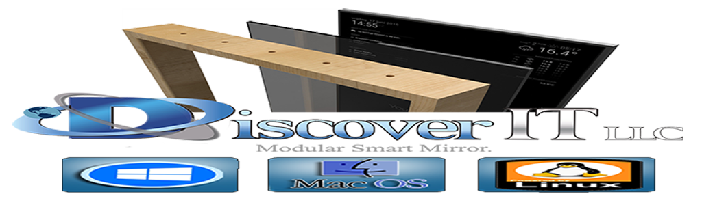

<p align="center">
	<a href="http://getdiscoverit.com/">
	<a href="http://getdiscoverit.com/">
	<a href="http://getdiscoverit.com/"></a>
	<a href="http://getdiscoverit.com/"></a>
	<a href="http://getdiscoverit.com/"></a>
	<a href="http://getdiscoverit.com/"></a>
</p>

## Installation

### Quick install

If you followed the default installation instructions for the [Discover-IT-LLC-Mirror²](https://github.com/DiscoverITLLC/MagicMirror) project, you should be able to use the automatic installer.
The following command will download the installer and execute it:
```bash
bash -c "$(curl -s https://raw.githubusercontent.com/DiscoverITLLC/MMM-Videoplayer/master/installer.sh)"
